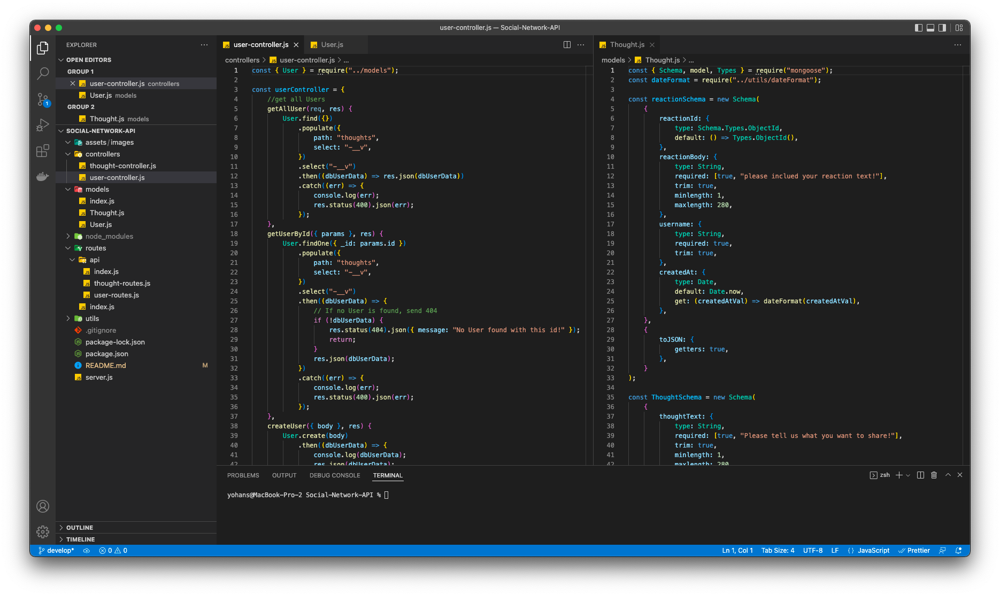

# Social-Network-API

## Description

This is a back-end for a social network application that uses a NoSQL database so that a website can handle large amounts of unstractured data to proform CRUD operation for creating user, thoughts, react to thoughts, and add/remove friends.

## Table of Contents

- [Technologies](#technologies)
- [Installation](#installation)
- [Usage](#usage)
- [Snapshot](#snapshot)
- [License](#license)
- [Tests](#tests)
- [License](#license)
- [Questions](#questions)

## Technologies

The following technologies are used to build this application

- MongoDB
- mongoose
- express.js

## Installation

Instructions for Installation:
this a public repo that can be clone to local machine by following the gitHub link, and install Node.js to your machine then from your command line npm i to install the following npm dependancies
{
"express": "^4.17.3",
"mongoose": "^6.2.9"
}

## Usage

after installation Routes can be tested and put to use with insomnia.

## Snapshot

This video shows /api/users for GET ,POST, PUT, and DELETE being tested in Insomnia:

[Video](https://drive.google.com/file/d/1YhGW1n-htBLoqK7XJyx9wWe312-x9NgV/view)

This video shows POST, DELETE routes for adding and removing friend being tested in Insomnia:

[Video](https://drive.google.com/file/d/1dYk5pEEnPXFFaujvpDa2O-EmbrakPJYW/view)

This video shows GET,POST, PUT, and DELETE routes for /api/thoughts/ being tested in Insomnia:

[Video](https://drive.google.com/file/d/1k50BD12He1dM_GLzarH_FAdO5Fwi07AN/view)

This video shows POST and DELETE routes, POST to create a reaction stored in a single thought's reactions array field, and DELETE to pull and remove a reaction by the reaction's reactionId value being tested in Insomnia:

[Video](https://drive.google.com/file/d/1Z5GnhYnv99i1dHsOgdXASh7fWnVXmXpE/view)

## License

The project is licensed under MIT.

[More Info](https://choosealicense.com/licenses/)

## Contributing

If you like to contribut for this project please follow The Contributor Convenant guidelines.

## Tests

## Questions

Please don't hesitate to reach out to us if you have any questions.

Yohans Getaneh

GitHub: https://github.com/yohans14/Social-Network-API

Email: yohans14@yahoo.com
